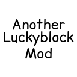

<div align="center">



# 🍀 Another Lucky Block Mod

**Мод на удачу для Minecraft, написанный на Kotlin с использованием Fabric API**

[](https://minecraft.net)
[](https://fabricmc.net)
[](https://kotlinlang.org)
[](https://adoptium.net)
[](LICENSE)
[](../../actions)

<br/>

*Сломай блок — и судьба решит, что будет дальше.*

</div>

---

## 📖 О моде

**Another Lucky Block Mod** — это Fabric-мод для Minecraft 1.21.11, добавляющий в игру **Счастливый Блок** (Lucky Block). При уничтожении блока происходит случайное событие: вас может ждать богатство или неминуемая гибель. Всё в руках удачи!

Мод написан полностью на **Kotlin** с использованием современного стека Fabric.

---

## ✨ Возможности

- 🟡 **Счастливый блок** — новый блок с уникальной текстурой и случайными событиями при разрушении
- 🔨 **Крафт** — блок крафтится из золотых слитков и удочки (см. раздел «Рецепты»)
- ⚡ **Fabric Data Generation** — рецепты и лут-таблицы генерируются автоматически
- 🎨 **Кастомные текстуры и модели** — уникальный визуальный стиль
- 🌐 **Поддержка клиента и сервера** — работает в обоих окружениях (`environment: *`)

---

## 🔧 Установка

### Требования

| Зависимость | Версия |
|---|---|
| Minecraft | `1.21.11` |
| Fabric Loader | `>= 0.18.6` |
| Fabric API | `0.141.3+1.21.11` |
| Fabric Language Kotlin | `1.13.10+kotlin.2.3.20` |
| Java | `>= 21` |

### Шаги установки

1. Установите [Fabric Loader](https://fabricmc.net/use/installer/) для Minecraft `1.21.11`
2. Скачайте [Fabric API](https://modrinth.com/mod/fabric-api) и поместите в папку `mods/`
3. Скачайте [Fabric Language Kotlin](https://modrinth.com/mod/fabric-language-kotlin) и поместите в `mods/`
4. Скачайте `.jar` файл этого мода из раздела [Releases](../../releases) и поместите в `mods/`
5. Запускайте игру и наслаждайтесь!

---

## ⚒️ Рецепты

### Счастливый Блок

<div align="center">

```
[ G ][ G ][ G ]
[ G ][ E ][ G ]
[ G ][ G ][ G ]
```

**G** = Золотой слиток &nbsp;|&nbsp; **E** = Удочка

*Результат: 1× Счастливый Блок*

</div>

---

## 🏗️ Сборка из исходников

### Клонирование репозитория

```bash
git clone https://github.com/ВАШ_ЮЗЕРНЕЙМ/another-luckyblock-mod.git
cd another-luckyblock-mod
```

### Сборка мода

```bash
# Linux / macOS
./gradlew build

# Windows
gradlew.bat build
```

Скомпилированный `.jar` файл появится в папке `build/libs/`.

### Запуск клиента для разработки

```bash
./gradlew runClient
```

### Генерация данных (рецепты, лут-таблицы)

```bash
./gradlew runDatagen
```

---

## 📁 Структура проекта

```
another-luckyblock-mod/
├── src/
│   ├── main/
│   │   ├── java/org/gaziz/luckyblock/       # Основной код (Kotlin)
│   │   │   └── mixin/                        # Mixin-классы
│   │   ├── generated/                        # Авто-генерируемые данные
│   │   │   └── data/.../recipe/              # Рецепты
│   │   └── resources/
│   │       ├── assets/another-luckyblock-mod/
│   │       │   ├── blockstates/              # Состояния блоков
│   │       │   ├── models/block/             # Модели блоков
│   │       │   ├── textures/block/           # Текстуры
│   │       │   └── lang/                     # Локализация
│   │       └── fabric.mod.json               # Метаданные мода
│   └── client/
│       └── java/org/gaziz/luckyblock/client/ # Клиентский код
├── build.gradle.kts                          # Конфигурация сборки
├── gradle.properties                         # Версии зависимостей
└── settings.gradle.kts
```

---

## 🛠️ Технологии

| Технология | Описание |
|---|---|
| **Kotlin 2.3.20** | Основной язык разработки |
| **Fabric Loom 1.16** | Инструментарий для моддинга |
| **Fabric API 0.141.3** | API для взаимодействия с игрой |
| **Fabric Data Generation** | Автогенерация рецептов и таблиц |
| **Gradle 9.4** | Система сборки |
| **Java 21** | JVM-платформа |

---

## 🗺️ Roadmap

> Здесь перечислены планируемые улучшения и новые возможности. Порядок может меняться.

- [x] ✅ **v1.0.0** — Базовый Счастливый Блок с текстурой и рецептом крафта
- [ ] 🎲 **v1.1.0** — Добавить случайные события при разрушении блока (лут, взрывы, мобы)
- [ ] 🌈 **v1.2.0** — Несколько вариантов Lucky Block с разным уровнем «удачи»
- [ ] 📜 **v1.3.0** — Конфигурационный файл для настройки шансов событий
- [ ] 🤝 **v1.4.0** — Поддержка мультиплеера: синхронизация эффектов между игроками
- [ ] 🌍 **v1.5.0** — Перевод на несколько языков (ru_ru, en_us, de_de)
- [ ] 🔮 **v2.0.0** — API для других модов — возможность добавлять свои события

---

## 🤝 Вклад в проект

Вклад приветствуется! Если вы хотите улучшить мод:

1. Форкните репозиторий
2. Создайте ветку для своей фичи (`git checkout -b feature/amazing-feature`)
3. Зафиксируйте изменения (`git commit -m 'Add amazing feature'`)
4. Запушьте ветку (`git push origin feature/amazing-feature`)
5. Откройте Pull Request

Для баг-репортов и предложений используйте раздел [Issues](../../issues).

---

## 📄 Лицензия

Этот проект распространяется под лицензией **CC0-1.0**. Подробнее см. файл [LICENSE](LICENSE).

---

<div align="center">

Сделано с ❤️ и Kotlin &nbsp;•&nbsp; [Fabric](https://fabricmc.net) &nbsp;•&nbsp; [Minecraft](https://minecraft.net)

</div>
